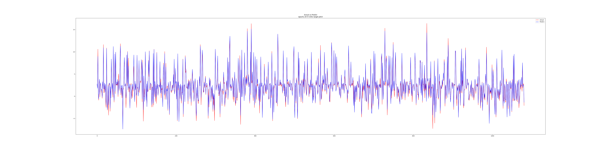
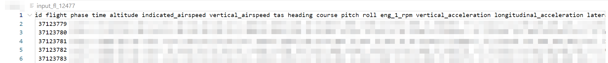

# Neural Network on flight prediction
Neural Network for flights pitch prediction<br>


## Data
The dataset is space speperated data. ` data_prepocess.py ` is used to converted the data into correct format.<br/>


## Get Start
Firstly, run Data Propocessing script<br/>
Keep ` data_prepocess.py `, ` main.py ` and ` nn.py ` in one directory<br>
and get into the directory<br>
And put the dataset in the same directory as the source code<br>

1. Using virtual environment(optional but recommended)<br>
```shell
python -m venv .venv
```

```shell
# if ussing global environment, skip below 2 lines
 .\.venv\Scripts\activate # windows
 # .\.venv\bin\activate  # linux
```

2. Install required package
```shell
 pip install -r requirements.txt
```

4. run the code
```shell
python ./main.py
```

you can run below commend for seperate data extraction
```shell
python ./data_prepocess.py
```

## reference
- https://github.com/glouw/tinn<br/>
- MSE Lim Bryan and Zohren Stefan 2021Time-series forecasting with deep learning: a surveyPhil. Trans. R. Soc. A.37920200209
http://doi.org/10.1098/rsta.2020.0209<br/>
- RMSE Chai, Tianfeng, and Roland R. Draxler. "Root mean square error (RMSE) or mean absolute error (MAE)." Geoscientific model development discussions 7.1 (2014): 1525-1534.<br/>
- Activation: M. M. Lau and K. Hann Lim, "Review of Adaptive Activation Function in Deep Neural Network," 2018 IEEE-EMBS Conference on Biomedical Engineering and Sciences (IECBES), Sarawak, Malaysia, 2018, pp. 686-690, doi: 10.1109/IECBES.2018.8626714.<br/>
