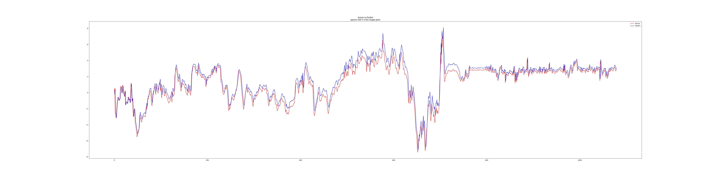

# Neural Network on flight prediction
Neural Network for flights pitch prediction. A C++ re-implementation for regression task from TINN library.<br>


## Data
The dataset is space speperated data. ` data_prepocess.py ` is used to converted the data into correct format.<br/>

## Get Start

1. Using virtual environment(optional but recommended)<br>
```shell
python -m venv .venv
```

2. Install required package
```shell
 pip install -r requirements.txt
```

3. Run the code
Run the extraction script for get required CSV data file<br/>
```shell
python ./data_prepocess.py
```

Compile the executable file
```shell
make
```

Then run the file
```shell
./main
```

## Reference
- https://github.com/glouw/tinn<br/>
- https://www.geeksforgeeks.org/backpropagation-in-neural-network/<br>
- Lim Bryan and Zohren Stefan 2021Time-series forecasting with deep learning: a surveyPhil. Trans. R. Soc. A.37920200209
http://doi.org/10.1098/rsta.2020.0209<br/>
- Chai, Tianfeng, and Roland R. Draxler. "Root mean square error (RMSE) or mean absolute error (MAE)." Geoscientific model development discussions 7.1 (2014): 1525-1534.<br/>
- M. M. Lau and K. Hann Lim, "Review of Adaptive Activation Function in Deep Neural Network," 2018 IEEE-EMBS Conference on Biomedical Engineering and Sciences (IECBES), Sarawak, Malaysia, 2018, pp. 686-690, doi: 10.1109/IECBES.2018.8626714.<br/>
